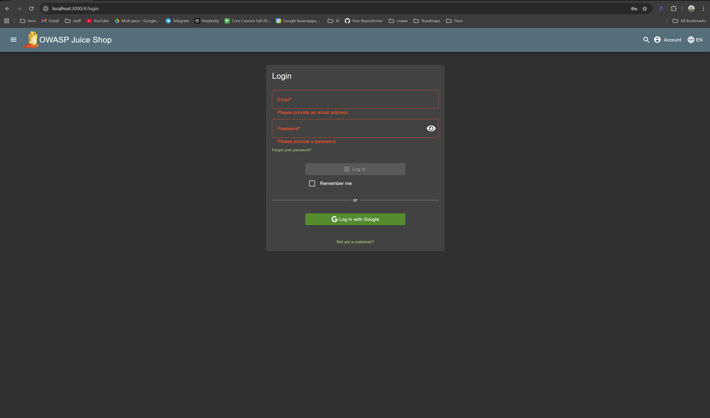
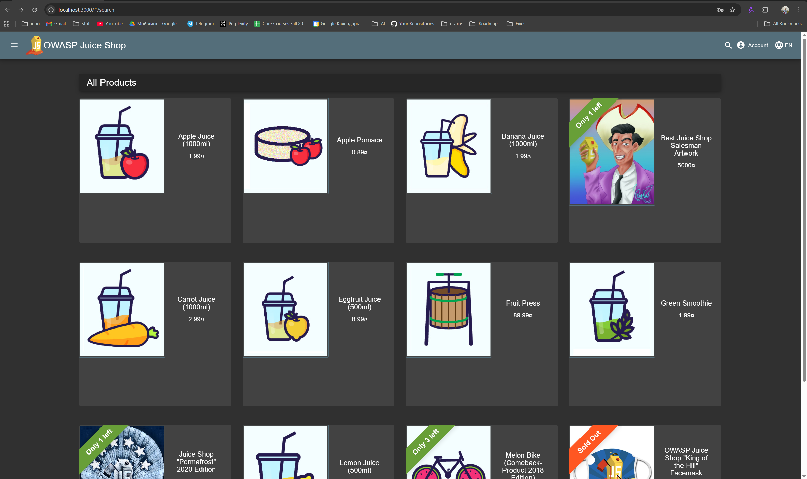
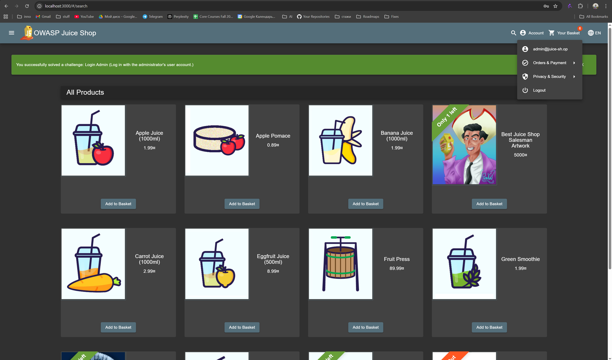

# Triage Report — OWASP Juice Shop

## Scope & Asset
- Asset: OWASP Juice Shop (local lab instance)
- Image: bkimminich/juice-shop:v19.0.0
- Release link/date: https://github.com/juice-shop/juice-shop/releases/tag/v19.0.0 — September 4, 2025
- Image digest (optional): <sha256:...>

## Environment
- Host OS: Windows 10 + WSL2
- Docker: 28.4.0

## Deployment Details
- Run command used: `docker run -d --name juice-shop -p 127.0.0.1:3000:3000 bkimminich/juice-shop:v19.0.0`
- Access URL: http://127.0.0.1:3000
- Network exposure: 127.0.0.1 only [x] Yes  [ ] No  (explain if No)

## Health Check
- Page load: attach screenshot of home page (path or embed)
  [](./assets1/1.3.png)
- API check: first 5–10 lines from `curl -s http://127.0.0.1:3000/rest/products | head`
  ```
  <html>
  <head>
    <meta charset='utf-8'>
    <title>Error: Unexpected path: /rest/products</title>
    <style>* {
  margin: 0;
  padding: 0;
  outline: 0;
  }
    ```

## Surface Snapshot (Triage)
- Login/Registration visible: [x] Yes  [ ] No — notes: [](./assets1/login.png)
- Product listing/search present: [x] Yes  [ ] No — notes: [](./assets1/products.png)
- Admin or account area discoverable: [x] Yes  [ ] No — notes: 

Used https://help.owasp-juice.shop/appendix/solutions.html#log-in-with-the-administrators-user-account first step
[](./assets1/admin.png)
- Client-side errors in console: [x] Yes  [ ] No — notes: 

When adding item to the cart from the product page using admin account:
```
vendor.js:1 ERROR TypeError: Cannot read properties of null (reading 'Products')
    at Object.next (main.js:1:163939)
    at R.next (vendor.js:1:1383405)
    at le._next (vendor.js:1:1383079)
    at le.next (vendor.js:1:1382765)
    at o._next (vendor.js:1:1383079)
    at o.next (vendor.js:1:1382765)
    at vendor.js:1:1206986
    at o._next (vendor.js:1:907122)
    at o.next (vendor.js:1:1382765)
    at vendor.js:1:1206986
```
- Security headers (quick look — optional): `curl -I http://127.0.0.1:3000` → CSP/HSTS present? notes:

No CSP or HSTS headers present. Only ```X-Content-Type-Options```, ```X-Frame-Options```, ```Access-Control-Allow-Origin``` found.

## Risks Observed (Top 3)
1) Missing Content Security Policy (CSP) - Easier to execute by allowing arbitrary JavaScript execution
2) API Endpoint Routing Issues - /rest/products endpoint returns 500
3) Open CORS Policy - ```Access-Control-Allow-Origin: *``` allows requests from any origin, enabling potential cross-origin attacks and data theft
