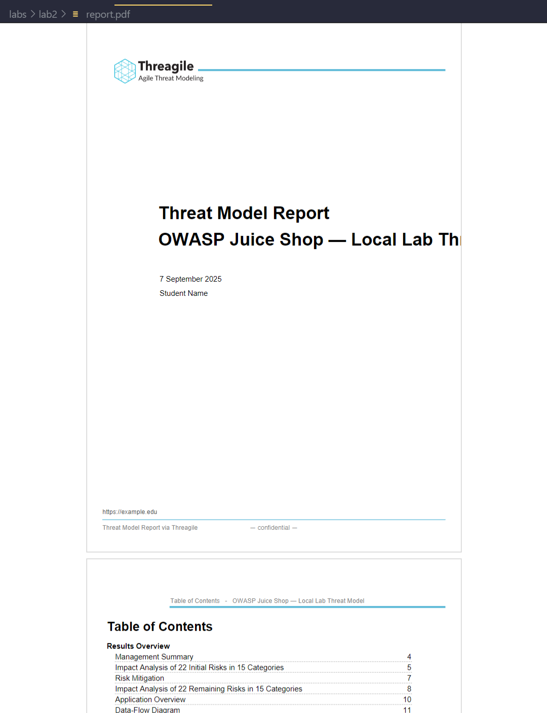
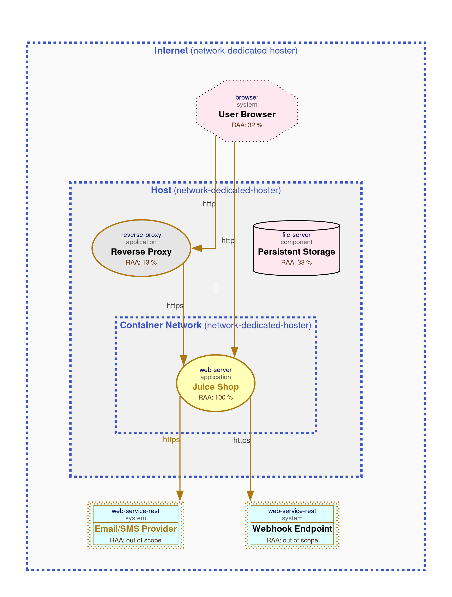

# Lab 2 — Threat Modeling (Threat Dragon + Threagile)
# Task 1
## Artifacts Generated

Ran with:
```
docker run --rm -it -v "$(pwd)":/app/work threagile/threagile \
  -verbose \
  -model /app/work/labs/lab2/threagile-model.yaml \
  -output /app/work/labs/lab2 \
  -generate-risks-excel=false \
  -generate-tags-excel=false
  ```

**Report opened:**

**Data flow diagram:**


## Top 5 Risks

| Rank | Severity | Category                  | Asset         | Likelihood | Impact | Composite Score |
| ---- | -------- | ------------------------- | ------------- | ---------- | ------ | --------------- |
| 1    | elevated | unencrypted-communication | user-browser  | likely     | high   | 433             |
| 2    | elevated | unencrypted-communication | user-browser  | likely     | high   | 433             |
| 3    | elevated | cross-site-scripting      | juice-shop    | likely     | medium | 432             |
| 4    | elevated | missing-authentication    | juice-shop    | likely     | medium | 432             |
| 5    | elevated | unencrypted-communication | reverse-proxy | likely     | medium | 432             |


## Delta Run

**Change Made**: Modified the "To App" communication link from Reverse Proxy to Juice Shop, changing protocol from `http` to `https` (line 268).

**Before:**
There was 3 ``unencrypted-communication`` risks
```
    {
        "category": "unencrypted-communication",
        "risk_status": "unchecked",
        "severity": "elevated",
        "exploitation_likelihood": "likely",
        "exploitation_impact": "high",
        "title": "\u003cb\u003eUnencrypted Communication\u003c/b\u003e named \u003cb\u003eDirect To App (no proxy)\u003c/b\u003e between \u003cb\u003eUser Browser\u003c/b\u003e and \u003cb\u003eJuice Shop\u003c/b\u003e transferring authentication data (like credentials, token, session-id, etc.)",
        "synthetic_id": "unencrypted-communication@user-browser\u003edirect-to-app-no-proxy@user-browser@juice-shop",
        "most_relevant_data_asset": "",
        "most_relevant_technical_asset": "user-browser",
        "most_relevant_trust_boundary": "",
        "most_relevant_shared_runtime": "",
        "most_relevant_communication_link": "user-browser\u003edirect-to-app-no-proxy",
        "data_breach_probability": "possible",
        "data_breach_technical_assets": [
            "juice-shop"
        ]
    },
    {
        "category": "unencrypted-communication",
        "risk_status": "unchecked",
        "severity": "elevated",
        "exploitation_likelihood": "likely",
        "exploitation_impact": "high",
        "title": "\u003cb\u003eUnencrypted Communication\u003c/b\u003e named \u003cb\u003eTo Reverse Proxy (preferred)\u003c/b\u003e between \u003cb\u003eUser Browser\u003c/b\u003e and \u003cb\u003eReverse Proxy\u003c/b\u003e transferring authentication data (like credentials, token, session-id, etc.)",
        "synthetic_id": "unencrypted-communication@user-browser\u003eto-reverse-proxy-preferred@user-browser@reverse-proxy",
        "most_relevant_data_asset": "",
        "most_relevant_technical_asset": "user-browser",
        "most_relevant_trust_boundary": "",
        "most_relevant_shared_runtime": "",
        "most_relevant_communication_link": "user-browser\u003eto-reverse-proxy-preferred",
        "data_breach_probability": "possible",
        "data_breach_technical_assets": [
            "reverse-proxy"
        ]
    },
    {
        "category": "unencrypted-communication",
        "risk_status": "unchecked",
        "severity": "elevated",
        "exploitation_likelihood": "likely",
        "exploitation_impact": "medium",
        "title": "\u003cb\u003eUnencrypted Communication\u003c/b\u003e named \u003cb\u003eTo App\u003c/b\u003e between \u003cb\u003eReverse Proxy\u003c/b\u003e and \u003cb\u003eJuice Shop\u003c/b\u003e",
        "synthetic_id": "unencrypted-communication@reverse-proxy\u003eto-app@reverse-proxy@juice-shop",
        "most_relevant_data_asset": "",
        "most_relevant_technical_asset": "reverse-proxy",
        "most_relevant_trust_boundary": "",
        "most_relevant_shared_runtime": "",
        "most_relevant_communication_link": "reverse-proxy\u003eto-app",
        "data_breach_probability": "possible",
        "data_breach_technical_assets": [
            "juice-shop"
        ]
    },
```

**After:**
There was only 2 ``unencrypted-communication`` risks
```
    {
        "category": "unencrypted-communication",
        "risk_status": "unchecked",
        "severity": "elevated",
        "exploitation_likelihood": "likely",
        "exploitation_impact": "high",
        "title": "\u003cb\u003eUnencrypted Communication\u003c/b\u003e named \u003cb\u003eDirect To App (no proxy)\u003c/b\u003e between \u003cb\u003eUser Browser\u003c/b\u003e and \u003cb\u003eJuice Shop\u003c/b\u003e transferring authentication data (like credentials, token, session-id, etc.)",
        "synthetic_id": "unencrypted-communication@user-browser\u003edirect-to-app-no-proxy@user-browser@juice-shop",
        "most_relevant_data_asset": "",
        "most_relevant_technical_asset": "user-browser",
        "most_relevant_trust_boundary": "",
        "most_relevant_shared_runtime": "",
        "most_relevant_communication_link": "user-browser\u003edirect-to-app-no-proxy",
        "data_breach_probability": "possible",
        "data_breach_technical_assets": [
            "juice-shop"
        ]
    },
    {
        "category": "unencrypted-communication",
        "risk_status": "unchecked",
        "severity": "elevated",
        "exploitation_likelihood": "likely",
        "exploitation_impact": "high",
        "title": "\u003cb\u003eUnencrypted Communication\u003c/b\u003e named \u003cb\u003eTo Reverse Proxy (preferred)\u003c/b\u003e between \u003cb\u003eUser Browser\u003c/b\u003e and \u003cb\u003eReverse Proxy\u003c/b\u003e transferring authentication data (like credentials, token, session-id, etc.)",
        "synthetic_id": "unencrypted-communication@user-browser\u003eto-reverse-proxy-preferred@user-browser@reverse-proxy",
        "most_relevant_data_asset": "",
        "most_relevant_technical_asset": "user-browser",
        "most_relevant_trust_boundary": "",
        "most_relevant_shared_runtime": "",
        "most_relevant_communication_link": "user-browser\u003eto-reverse-proxy-preferred",
        "data_breach_probability": "possible",
        "data_breach_technical_assets": [
            "reverse-proxy"
        ]
    },
```

**Reason**: Adding HTTPS encryption between the reverse proxy and application prevents potential man-in-the-middle attacks.

## Comparison with Threat Dragon

Since Task 2 now is optional to solve, I cannot run Threat Dragon and make this comparison.