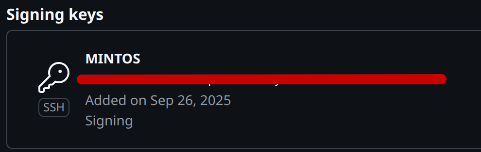
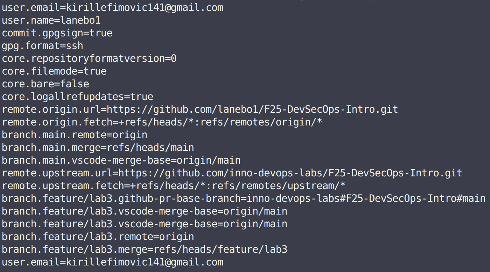
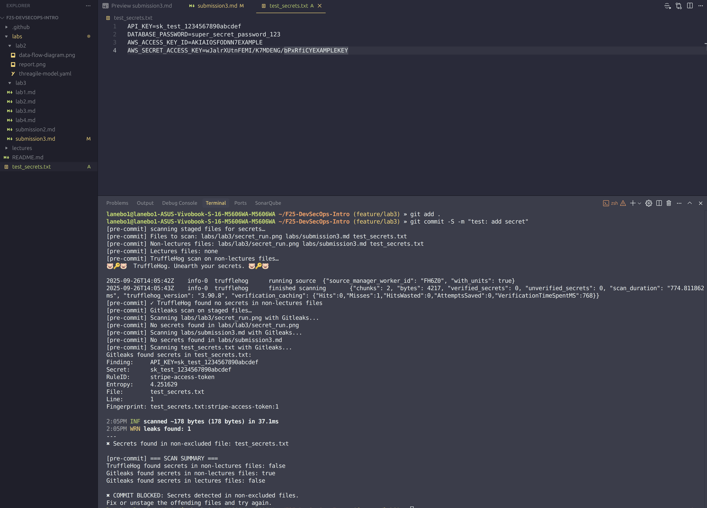
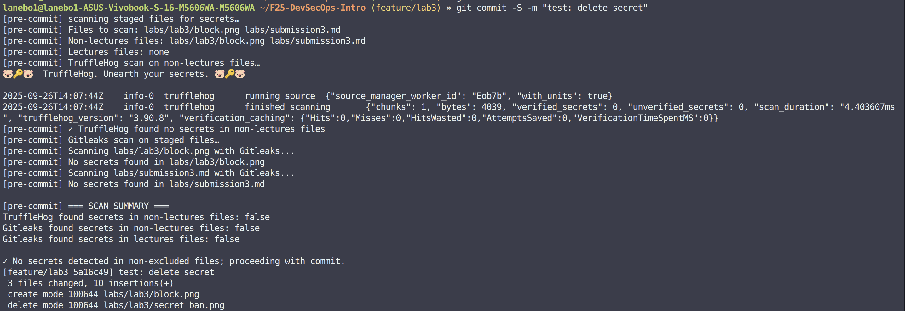

# Lab 3 Submission: Secure Git Implementation

## Task 1 — SSH Commit Signature Verification

### Summary: Benefits of Signing Commits for Security

- Verifies the identity of the commit author, preventing impersonation attacks
- Ensures commit contents haven't been tampered with during transmission
- Protects against unauthorized code modifications in collaborative environments
- GitHub displays "Verified" badges for signed commits

### Evidence of Successful SSH Key Setup and Configuration



### Git Configuration for SSH Signing



### Analysis: Why is Commit Signing Critical in DevSecOps Workflows?

In modern software development, any compromised developer account can inject malicious code that propagates through CI/CD pipelines. Commit signing ensures that any unauthorized modifications can be detected before they reach production environments.

DevSecOps emphasizes traceability and accountability. Signed commits create immutable records of who made what changes and when. This is essential for security incident investigations

### GitHub Verification Status


---

## Task 2 — Pre-commit Secret Scanning Implementation

### Pre-commit hook setup process and configuration

Took from Lab 3 task, pasted it in ```.git/hooks/pre-commit```, gave it permissions ```chmod +x .git/hooks/pre-commit```.

### Evidence of successful secret detection blocking commits



### Test results showing both blocked and successful commits




### Analysis of how automated secret scanning prevents security incidents

Automated secret scanning prevents security incidents by proactively detecting and blocking credentials like API keys, passwords, and tokens before they can be committed to version control. This early detection aligns with DevSecOps "shift-left" principles, catching vulnerabilities at the development stage rather than after deployment.

